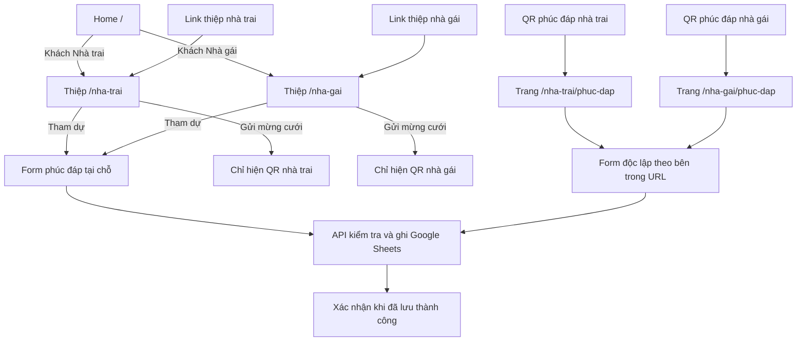

# 07 — Link thiệp theo bên mời, phúc đáp và QR mừng cưới

## Đường dẫn đã chốt

| Đường dẫn | Nội dung | Nút Gửi mừng cưới |
| --- | --- | --- |
| `/` | Home với hai nút Khách Nhà trai / Khách Nhà gái | Chọn bên để mở thiệp tương ứng |
| `/nha-trai` | Thiệp nhà trai, form phúc đáp tại chỗ | Chỉ QR nhà trai |
| `/nha-gai` | Thiệp nhà gái, form phúc đáp tại chỗ | Chỉ QR nhà gái |
| `/nha-trai/phuc-dap` | Trang phúc đáp của Nhà trai | Liên kết quay về thiệp Nhà trai |
| `/nha-gai/phuc-dap` | Trang phúc đáp của Nhà gái | Liên kết quay về thiệp Nhà gái |
| `/nha-trai/:slug` | Thiệp mời cá nhân Nhà trai, tên lấy từ Sheet | Chỉ QR Nhà trai |
| `/nha-gai/:slug` | Thiệp mời cá nhân Nhà gái, tên lấy từ Sheet | Chỉ QR Nhà gái |

Home, hai thiệp và hai trang phúc đáp nằm trong cùng dự án/tên miền. Route gốc `/` hỏi “Bạn là khách của bên nào?”; hai nút dẫn đến `/nha-trai` và `/nha-gai`. Home luôn cho khách chọn, không tự chuyển theo lịch sử. Mỗi link thiệp hoặc phúc đáp mở trực tiếp và xác định đúng bên từ URL. Tên miền production chưa được tạo, chưa có link thật để thay đích QR. Giữ các đường dẫn ổn định sau khi bàn giao.

## Luồng khách mời

Mọi form dùng cùng thành phần, dữ liệu và hạn trả lời. Mừng cưới độc lập với RSVP, không yêu cầu xác nhận tham dự trước và không đóng theo hạn RSVP.

## Thiệp nhà trai và nhà gái

Mỗi khách có thể nhận link cá nhân như `/nha-trai/nguyen-van-a`. Thiệp hiện “Nguyễn Văn A” từ tab tương ứng và điền trước câu tên trong form. Công thức Google Sheets tạo slug/link ngay khi nhập tên. Chi tiết ở [tài liệu link cá nhân](08-link-moi-ca-nhan.md).

Hiển thị Tuấn Anh & Ngọc Anh, 11:00 ngày 21/10/2026, địa điểm, ảnh và Google Maps có ghim. Nút **Tham dự** mở form ngay trong trang; đóng hộp thoại quay về vị trí đang đọc. Nút **Gửi mừng cưới** mở duy nhất QR của bên tương ứng với đường dẫn. Không hiển thị hai QR cùng lúc và không có nút chuyển bên trong hộp thoại mừng cưới.

Bên mời lấy từ route, không lấy từ lịch sử truy cập. Mở đồng thời link nhà trai và nhà gái phải cho QR đúng từng tab. Nếu QR của một bên chưa được cung cấp, không tự chuyển sang QR của bên khác.

## Hai trang phúc đáp theo bên mời

Khách Nhà trai quét QR để vào thẳng `/nha-trai/phuc-dap`; khách Nhà gái vào `/nha-gai/phuc-dap`. Trang hiển thị nhãn bên mời, thông tin tiệc ngắn gọn và bốn câu hỏi: tên; tham gia/đang cân nhắc/không tham gia; tổng số người tính cả khách; nguồn quen biết cô dâu/chú rể. Hiện hạn hết ngày 15/10/2026 giờ Việt Nam. Liên kết “Xem thiệp mời” dẫn về đúng bên; không cần chọn lại bên hoặc tải album/bản đồ trước khi điền form.

Sheet có cột `invitation_side`: từ thiệp hoặc phúc đáp nhà trai là `groom`, từ thiệp hoặc phúc đáp nhà gái là `bride`. Khách không phải chọn thêm bên mời; API bắt buộc giá trị hợp lệ. Metadata này hỗ trợ phân loại nguồn phản hồi, không chứng thực khách thuộc gia đình nào.

## Cấu hình QR mừng cưới

- `gift.accounts.groom`: ảnh và thông tin người nhận của nhà trai.
- `gift.accounts.bride`: ảnh và thông tin người nhận của nhà gái.
- Mỗi tài khoản có `label`, `accountName`, `bankName`, `accountNumber`, `qrImage`. Giá trị còn thiếu để `null`; chỉ dùng dữ liệu thật chủ tiệc cung cấp.
- Ảnh gốc đặt trong `public/images/qr/`, tham chiếu bằng `/images/qr/...`. Giữ ảnh nét và viền trắng; không vẽ lại mã.
- Có nút tải đúng ảnh QR đang xem để thuận tiện dùng trên cùng điện thoại. Website không tự xác nhận giao dịch ngân hàng.

## Việc còn cần để có link dùng được

1. Lập trình trang phúc đáp/API, kết nối Sheet và kiểm thử gửi thật.
2. Tạo repository GitHub và Cloudflare project để phát hành tại tên miền ổn định.
3. Bàn giao hai link production `/nha-trai/phuc-dap`, `/nha-gai/phuc-dap`; chủ tiệc gắn đúng link cho QR của từng bên rồi quét kiểm tra.
4. Nhận ảnh QR mừng cưới nhà trai/nhà gái, gắn đúng từng link và kiểm thử trên điện thoại. Thiếu các ảnh này không cản việc làm trang phúc đáp.
