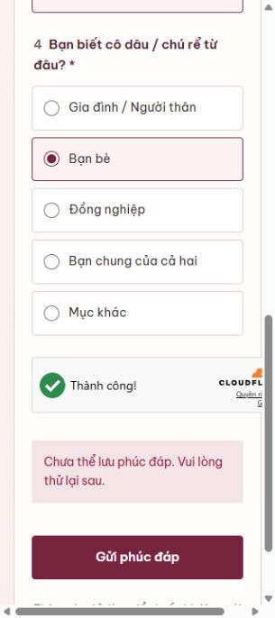
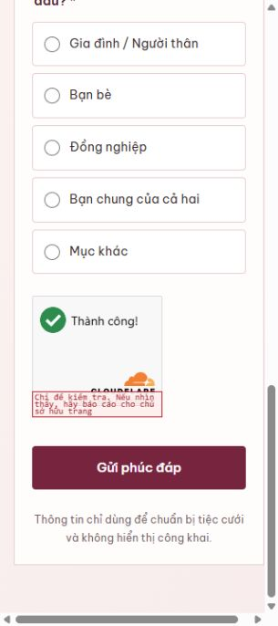
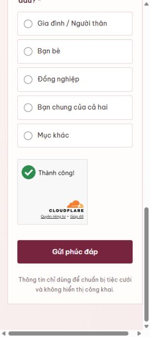
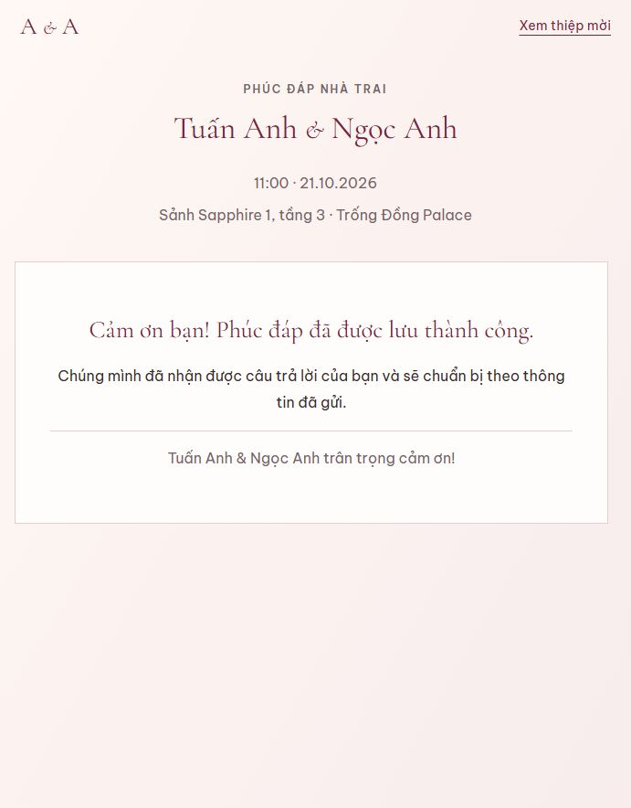
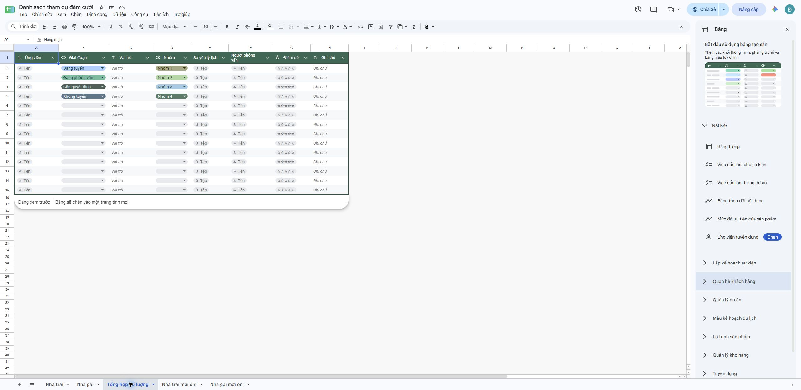

# Kiểm thử website Cloudflare — 30/09/2026

Website: https://wedding.tanawedding.workers.dev/

Kiểm tra trực tiếp trên bản đang chạy, bằng trình duyệt Chromium và các yêu cầu HTTP nhỏ. Không sửa frontend, không thay cấu hình Cloudflare, không công khai Google Sheet.

## Lỗi và phần chưa hoàn thiện

| Mức độ | Kết quả thực tế |
| --- | --- |
| Cao | Tra cứu thiệp cá nhân của cả groom và bride trả HTTP 503 `INVITATION_SERVICE_UNAVAILABLE`, kể cả slug thử không tồn tại. Chưa thể xác nhận điền sẵn tên khách. |
| Cao | Gửi phúc đáp từ hai trang riêng đều hiển thị “Chưa thể lưu phúc đáp. Vui lòng thử lại sau.” sau khi Turnstile tự xác minh thành công. Chưa xác nhận được ghi đúng tab hoặc tổng hợp số lượng. |
| Vừa | Form nhà gái ở viewport 320px có `document.documentElement.scrollWidth = 337`, lớn hơn viewport. 390, 768, 1440px không tràn ngang trong những trạng thái đã kiểm tra. Chưa xác định chắc chắn phần tử gây tràn. |
| Chưa hoàn thiện | Hai cửa sổ mừng cưới hiển thị đúng Nhà trai/Nhà gái nhưng chỉ có thông báo đang cập nhật, chưa có QR. |
| Chưa hoàn thiện | Thiệp nhà trai và nhà gái không có ảnh cưới trong DOM đã kiểm tra. |

503 cho thấy chức năng kết nối Google Sheets chưa hoạt động trên production. Chưa truy cập nhật ký Worker hoặc cấu hình secrets nên chưa kết luận nguyên nhân là khóa, quyền chia sẻ, Sheet ID, tên tab hay hàng tiêu đề. Với phúc đáp còn cần kiểm tra tiêu đề A1:J1 theo `google-sheets/rsvp-headers.tsv`.

## Các kiểm tra đã đạt

- Home chọn đúng nhà trai/nhà gái, chữ A & A, không thấy badge “Thiệp mời Nhà gái”.
- Nhà trai hiển thị Lễ Thành Hôn và lễ tại tư gia; nhà gái hiển thị Lễ Vu Quy và đúng thứ tự tên, gia đình.
- Ngày giờ, sảnh Sapphire 1 tầng 3, địa chỉ và lịch trình khớp cấu hình thiệp.
- Nút Tham dự mở form ngay trên thiệp nhà trai; Escape đóng cửa sổ.
- Trang phúc đáp riêng hai bên tải được; tải lại trực tiếp trang nhà gái vẫn hoạt động.
- Ba lựa chọn tham dự; số người Mục khác nhập được 25; quan hệ Mục khác mở ô bổ sung. Chưa gửi thành công để xác minh toàn bộ luồng số lượng tùy chọn.
- Chọn không tham dự ẩn câu hỏi số người.
- Google Maps tải được bản đồ và ghim Trống Đồng Palace tại Hancorp Plaza / 72 Trần Đăng Ninh. Link chỉ đường chứa địa chỉ này.
- Thiệp nhà trai không tràn ngang ở các viewport 320, 390, 768, 1440px.
- Turnstile có cấu hình trên production và tự hiển thị Thành công trong trình duyệt kiểm thử.

## Kiểm tra API không ghi dữ liệu

| Yêu cầu | Kết quả |
| --- | --- |
| GET /api/rsvp | 405 METHOD_NOT_ALLOWED |
| GET API không tồn tại | 404 JSON NOT_FOUND |
| GET /api/invitation với side không hợp lệ | 400 INVALID_SIDE |
| POST /api/rsvp thiếu dữ liệu | 400 VALIDATION_FAILED |
| POST /api/rsvp từ Origin https://example.com | 403 FORBIDDEN |
| POST hợp lệ về cấu trúc nhưng token development-bypass | 400 TURNSTILE_FAILED |

API trả JSON, Cache-Control no-store và X-Content-Type-Options nosniff trong phản hồi đã xem. Đây là kiểm tra bảo vệ cơ bản, không phải kiểm thử tải hoặc chứng nhận an toàn tuyệt đối.

## Phúc đáp thử

Hai lần gửi qua UI dùng tên `KIỂM THỬ CODEX 30-09-2026 NHÀ TRAI` và `KIỂM THỬ CODEX 30-09-2026 NHÀ GÁI`, chọn không tham dự, quan hệ bạn bè. Cả hai báo lỗi lưu. Không quan sát được phản hồi thành công; chưa đọc Sheet để xác nhận có dòng phát sinh hay không. Không gửi dữ liệu khách thật, không xóa dòng trên Sheet.

## Cần kiểm tra lại sau khi xử lý

1. Xem nhật ký lỗi Worker của tra cứu thiệp và ghi phúc đáp; kiểm tra service account, Sheets API, quyền Editor trên Sheet riêng tư và env runtime.
2. Kiểm tra tên và hàng tiêu đề tab Nhà trai/Nhà gái, đọc một slug thử đã tạo trong tab mời onl.
3. Gửi phúc đáp có/không/cân nhắc cho mỗi bên, đối chiếu đúng tab và tổng số người; thử gửi lại cùng submission_id.
4. Sửa tràn ngang 320px sau khi người dùng đồng ý sửa FE; kiểm tra lại khi Turnstile đã tải.
5. Cung cấp QR và ảnh cưới, sau đó xác minh hiển thị đúng bên.
6. Kiểm thử Safari/iOS, Android và thiết bị cũ thật. Lần này chỉ mô phỏng kích thước viewport trên Chromium, chưa đo hiệu năng thiết bị thật.

## Sửa tràn ngang sau khi người dùng đồng ý

- Commit `c5982a0`: Turnstile chuyển sang compact khi chiều rộng vùng chứa dưới 300px; vùng rộng hơn dùng flexible. Theo [tài liệu Cloudflare](https://developers.cloudflare.com/turnstile/get-started/client-side-rendering/widget-configurations/), flexible có chiều rộng tối thiểu 300px còn compact rộng 150px.
- Đo lại khi vùng chứa thay đổi bằng ResizeObserver; trình duyệt không hỗ trợ dùng sự kiện resize. Khi đổi dạng widget, xóa token cũ và xác minh lại.
- Build production của giao diện HEAD với duy nhất component đã sửa: đạt. Kiểm thử dùng site key thử nghiệm công khai của Cloudflare trên localhost, không gửi phúc đáp lên Sheet.
- Form riêng ở 320px: scrollWidth 320px, vùng chứa widget 246px; widget compact hiển thị thành công.
- 390/768/1440px: không tràn ngang, widget trở về dạng flexible và xác minh thành công khi đổi kích thước.
- Popup ở 320px: pageWidth 320px, modalScrollWidth bằng modalWidth 285px, vùng chứa widget 249px.
- Đã push commit lên main. Các thay đổi frontend có sẵn khác trong workspace không nằm trong commit này.
- Cloudflare đã triển khai bundle mới `index-BK6tqmLX.js`. Kiểm tra lại trang nhà gái/phúc đáp online ở 320px: scrollWidth 320px, widget compact hiển thị Thành công, không tràn ngang.

## Kiểm thử lại kết nối Google Sheets — 30/09/2026

### Đã hoạt động

- API tra cứu thiệp cá nhân của cả hai bên trả `INVITATION_NOT_FOUND` (404) cho slug thử không tồn tại, thay cho lỗi kết nối 503 trước đây. Điều này xác nhận Worker đã đọc được Google Sheet.
- Gửi phúc đáp thử `declined` qua giao diện production thành công cho Nhà trai và Nhà gái. Mỗi dòng xuất hiện đúng tab, có `guest_count=0`, quan hệ `friend` và `invitation_side` tương ứng `groom`/`bride`.
- Turnstile tự xác minh và server vẫn từ chối origin khác, token development giả và phương thức không hợp lệ.
- Trang chủ và thiệp Nhà gái không tràn ngang ở 320px; bản đồ vẫn tải. 22 kiểm thử mã nguồn đạt và bản build hiện tại hoàn tất.

### Vẫn còn lỗi hoặc thiếu cấu hình

- `Tổng hợp số lượng` vẫn hiển thị 0 dù hai dòng phúc đáp đã tồn tại. Ô B3 đang tham chiếu `=COUNTIF('Nhà trai'!B3:B;"<>")` thay vì bắt đầu từ B2. Nguyên nhân là API append hiện dùng `insertDataOption=INSERT_ROWS`; khi chèn dòng 2, Google Sheets tự dịch các tham chiếu tổng hợp từ dòng 2 xuống dòng 3. Cần đổi cách append không chèn hàng và khôi phục công thức tổng hợp về dòng 2.
- `Nhà trai mời onl` và `Nhà gái mời onl` đang trống; B2/C2 cũng chưa có công thức mảng tạo slug/link. Vì vậy chưa thể kiểm thử một link cá nhân hợp lệ hoặc tự điền tên khách.
- Giao diện Google Sheets báo tài liệu đang “Công khai trên web”. Cần đưa General access về Restricted; service account đã được chia sẻ Editor vẫn tiếp tục đọc/ghi được.
- QR mừng cưới và ảnh cưới vẫn chưa được cấu hình trên website.

Hai dòng thử có tên `KIỂM THỬ CODEX 30-09-2026 ... LẦN 2` được giữ lại để đối chiếu và không làm tăng tổng khách vì đều chọn không tham dự.

